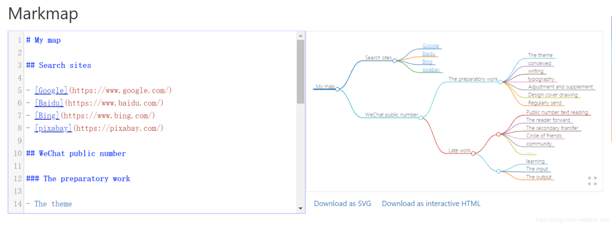

**DoIt** 主题模板中嵌入思维导图的语法学习。

<!--more-->

### 介绍
本文将介绍 Markdown 绘制思维导图的开源工具——**`Markmap`**。

如果你会用 Markdown 基本语法，那么这款 Markmap 思维导图工具也会很快上手的，如果不会 Markdown 的语法，也可以参考这篇文章：**[《为什么要学习 Markdown？究竟有什么用？》](https://markdown.com.cn/intro.html#markdown)**

即便你第一次听说 Markdown 也没关系，也不会影响你用 Markmap 的烦恼，哪怕你之前使用的其他什么思维导图工具，都是通过频繁的设计、选择图形、还是画线等等，通过 Markmap 即可一切帮你搞定。

Markmap 支持直接将 Markdown 语法内容按照标题到内容的顺序渲染为 SVG 格式的思维导图，渲染出来的导图可缩放、也可展开收起子节点，样式也非常美观。



### 使用方法

使用 Markmap 绘制思维导图，只需三个符号。
- #:标题
- -：列表
- ---：分隔符

通过使用如上三个符号，即可轻松的添加子分支。同时为了能够更好的与 Markdown 配合，通过使用 Markdown 的代码块和自定义的语法来作为在 Markdown 中绘制思维导图的语法，如下所示：

```markdown
# My map

## Search sites

- [Google](https://www.google.com/)
- [Baidu](https://www.baidu.com/)
- [Bing](https://www.bing.com/)
- [pixabay](https://pixabay.com/)

## WeChat public number

### The preparatory work

- The theme
- conceived
- writing
- typography
- Adjustment and supplement
- Design cover drawing
- Regularly send

### Late work

- Public number text reading
- The reader forward
- The secondary transfer
- Circle of friends
- community
- ......

---

- learning
- The input
- The output
```
由此，我们在通过 Markdown 编辑器编写文章时，就可以通过添加块代码的方式来快速绘制思维导图，如上代码实现后的结果所示：


### Markmap优点
- 轻量化、在线直接使用；
- 开源免费；
- 语法字符简单，一键生成导图；
- 可下载为 SVG 和 HTML 格式的文件；
  
### 扩展地址
**Markmap：**  
地址：[https://markmap.js.org/repl/)](https://pixabay.com/)  
**GitHub markmap：**  
地址：[https://github.com/dundalek/markmap)](https://github.com/dundalek/markmap)  
**GitHub markmap-lib：**  
地址：[https://github.com/gera2ld/markmap-lib)](https://github.com/gera2ld/markmap-lib)


### 总结
Markmap 这款思维导图工具可有效的帮助经常编写文档的小伙伴们，在编写完后，生成一个类似于文档目录的思维导图，简单明了的可以看出该文章包含的哪些章节，如果你有经常绘制思维导图的习惯，不妨可以试试 Markmap。
