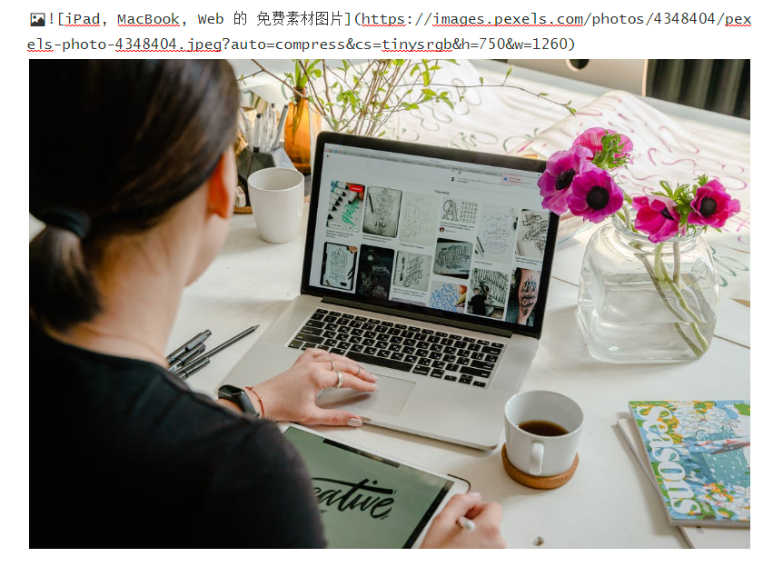
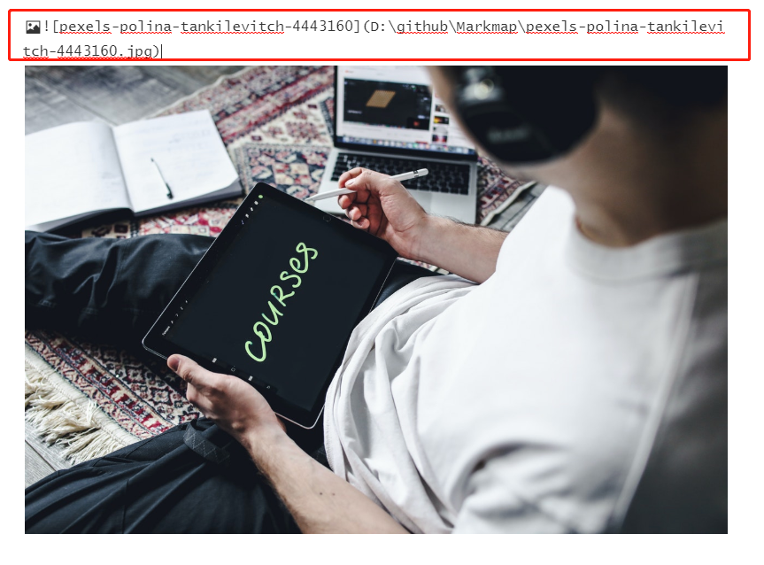
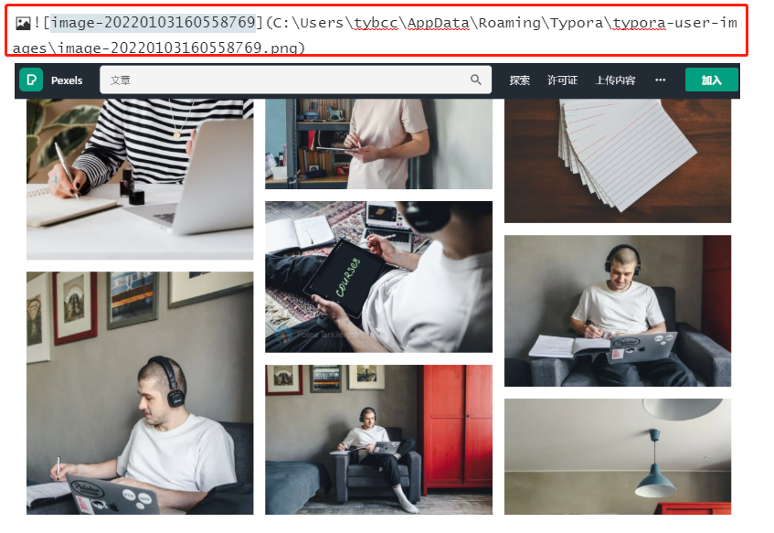
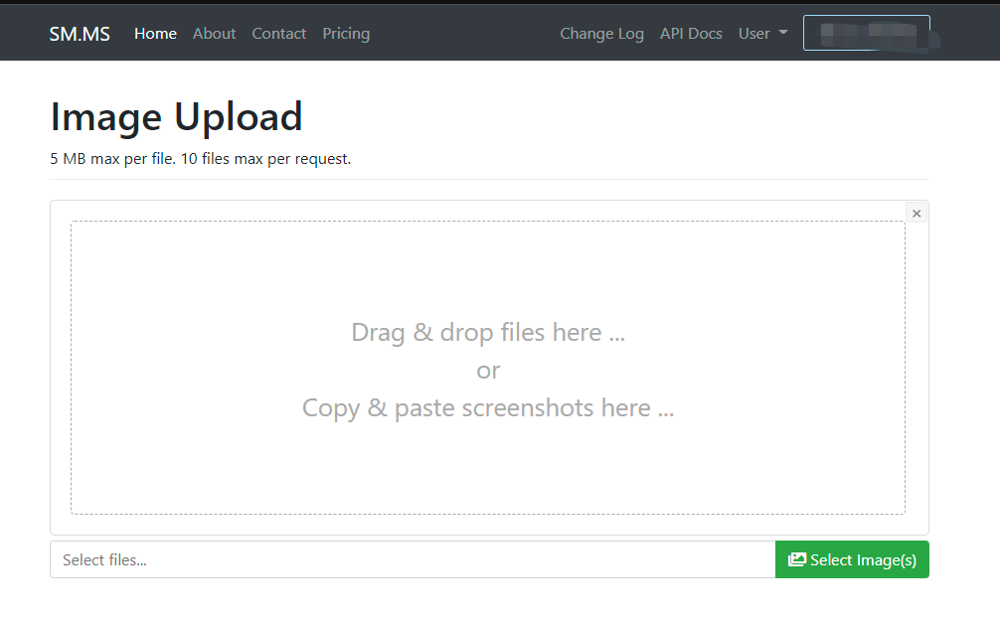
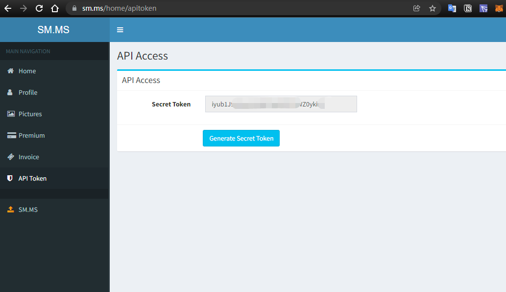
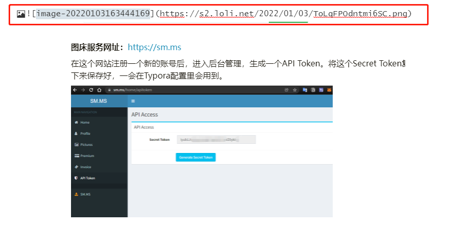

这篇文章主要介绍在编写markdown时，用最简单快捷的方法插入图片。

<!--more-->

之前，我们在使用记事本，学习基础性的markdown语法过程中，已经接触到了在markdown文件里插入图片的语法如下：  

```markdown

```

那现在，当我们想把屏幕已经打开的图片直接拖到记事本里，或者想屏幕上截取的图片直接复制粘贴到记事本里是无法实现了。这样使用记事本这样的纯文本编辑器来编写markdown文件就显得不是很方便了。

所以今天，我们将共同了解和学习一款编辑器，这款编辑器号称是这个世界上编写markdown最便捷的一款编辑器，也就是Typora。


**Typora官方下载地址：**[http://typora.io/](http://typora.io/?_blank) 

有一种爱情叫做一见钟情，当你看到Typora的第一眼，我相信很多人就会开始爱上它。它没有专业软件那么复杂而难以上手的功能，却也没有为了简洁而妥协到难以使用，它的每一寸肌肤都恰到好处，与它相处的每一刻都十分愉悦。

现在我们把他下载下来安装到电脑上，我们现在来使用typora，在markdown文件里做两种不同的插入图片的效果。

### 直接将图片拖入到markdown文件中

比如，我们打开了一个网站，在这个网站上有你比较感兴趣的一张图片，这是你就可以直接将图片直接拖到你的markdown文件上，然后typora会自动将该图片显示在你的文件上，如下图：


这种拖拽图片的方式，是将已经在网络上存储的图片地址自动化的填入到你的MD文件中了。那如果我想把我自己本地电脑中的图片拖到MD文件里会怎么样呢？

那我们现在从电脑上直接拖一张图片到MD文件里，看看出现什么变化：



这时，图片已经显示出来了，同时Typora会把我们拖到MD文件的图片的源位置地址给显示出来。

### 将屏幕截屏后，按住Ctrl+V直接粘贴到MD文件中。

通过这种方式操作后，Typora会将我们通过屏幕截取的图片自动化存放在一个指定的本地路径下，并且同时显示在MD文件上。如下图：




当MD文件里的图片是以本地路径保存时，这时如果你将MD文件发给其他朋友浏览时，将会出现图片打不开的情况。因为MD文件和图片是分离的，你只是将MD文件发送给对方，但是图片还在你自己电脑中存放。所以对方无法正常显示文档中的图片。



### Typora+图床，让写作的体验如丝滑般顺滑

为了避免出现以上这种情况，我们能否有一种比较好的方法，实现不论是从本地拖入图片还是直接屏幕截屏，这个MD文档不论发给谁，MD中的图片对方都能正常打开显示呢？

当然有办法！接下来，我们继续学习Typora图床的用法。所谓图床，简单的说，就是我们将本地图片拖入到MD上时，这个MD可以自动将图片文件转化生成一个在线的URL地址，而非本地文件URL地址。

#### 在sm.ms上开通图床服务

首先，我们先去下面这个平台开通一下图床服务：



**图床服务网址：**[https://sm.ms](https://sm.ms)

在这个网站注册一个新的账号后，进入个人的后台管理，找到左侧菜单的`API Token` ，再点击页面中间的蓝色按钮，生成一个API Token。将这个Secret Token复制下来保存好，一会在Typora配置里会用到。



 

#### 配置Typora图片服务

我们在Typora软件上点击顶部菜单上的文件-偏好设置后出现以下界面：


在**插入图片时的动作行为**选择：`上传图片`

在**上传服务**选择：`PicGo=Core（command line `

我们点开`打开配置文件`，或者进入配置文件的目录，目录地址一般地址是：C:\Users\用户 \ \.picgo\下，找到coinfig.json文件，用记事本打开。然后将以下代码复制到这个记事本文件中，注意将`token`后面`双引号内的内容`改成刚才你在sm.ms上生成的secret token。修改完保存即可。

```json
{
  "picBed": {
    "current": "smms",
    "smms": {
        "token": "在Sm.ms上生成的Secret Token"
    }
  },
  "picgoPlugins": {}  
}
```

修改完成后保存关闭。

完成后，我们配置工作就结束了。现在我们再来在MD上直接拖入或粘贴一张截屏的图片试试效果。



现在可以看到，我们复制到MD上的图片文件，已经自动生成了一个在线链接的地址。我们将MD文档发给任何人，对方打开都可以正常显示图片了。


由于目前typora已经开始正式收费，目前`中国特惠终身版`的价格是`89元`，当然如果你不想花钱，亦可联系张同学以获得`Typora1.0`以下的版本，也是可以终身免费使用的。


